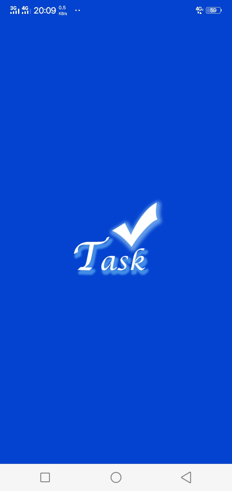

# Tasklist App 

    

## Contents

- [Description](#description)
- [Features](#features)
- [Requirements](#requirements-for-development)
- [Installation](#installation-for-development)
- [Screenshoots](#screenshoots)
- [APK Release](#apk-release)

## Description

Aplikasi untuk memanage timeline tugas atau list pekerjaan kita.

## Features

- Tambah, delete, dan edit task/tugas
- jam baris
- Update nama user

## Requirements for Development

- [`Node Js`](https://nodejs.org/en/)
- [`npm`](https://www.npmjs.com/get-npm)
- [`react-native`](https://facebook.github.io/react-native/docs/getting-started)
- [`react-native-cli`](https://facebook.github.io/react-native/docs/getting-started)

## Installation for Development

1. Buka terminal or command prompt
2. Ketikkan `git clone https://github.com/solehudin5699/RefactoryId-techtest.git`
3. Buka folder `mobile-task-list` dan jalankan `npm install` untuk install dependencies
4. Run `react-native run-android` pada terminal untuk run app.

## Screenshoots

    
    
    

    
    
    

## APK Release

Download apk release dan install pada android melalui link di bawah

